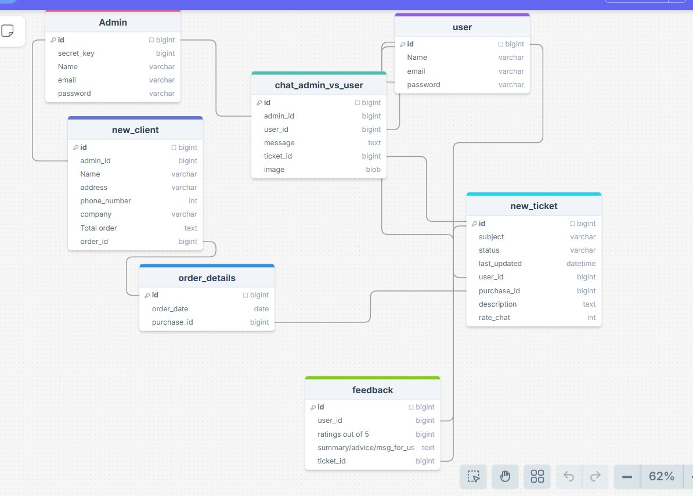

<div align="center">


# 🗄️ Suvidha CRM — Database Schema

Interactive ERD for the Suvidha CRM system.  
Drag tables freely · Hover to trace relations · Crow's foot notation · Field-level tooltips

---

## 🔴 Live Demo

> **Replace `YOUR_USERNAME` with your GitHub username before publishing**

[](https://github.com/ANUBHAV-03042004/Suvidha-crm-schema.github.io/suvidha-crm-schema/)

---

## 🖼️ Embedded Interactive Diagram

<!-- GitHub markdown doesn't support iframes — use the badge link above.   -->
<!-- For wikis, Notion, or any HTML-capable page, paste the iframe below:  -->
<!--                                                                        -->
<!-- <iframe                                                                 -->
<!--   src="https://YOUR_USERNAME.github.io/suvidha-crm-schema/"           -->
<!--   width="100%" height="600"                                            -->
<!--   style="border:none;border-radius:12px;"                              -->
<!--   title="Suvidha CRM Database Schema"                                  -->
<!-- ></iframe>                                                              -->


*Static preview — click the badge above for the fully interactive version*

---

## 🚀 Deploy in 4 Steps

### Step 1 — Clone & configure

```bash
git clone https://github.com/YOUR_USERNAME/suvidha-crm-schema.git
cd suvidha-crm-schema
```

Open **`vite.config.js`** and confirm the `base` matches your repo name:

```js
// vite.config.js
export default defineConfig({
  plugins: [react()],
  base: '/suvidha-crm-schema/',   // ← must match your repo name exactly
})
```

### Step 2 — Push to GitHub

```bash
git add .
git commit -m "init: Suvidha CRM schema diagram"
git push origin main
```

### Step 3 — Enable GitHub Pages

1. Go to your repo on GitHub
2. **Settings → Pages**
3. Under **Source** select **GitHub Actions**
4. Save

### Step 4 — Done ✅

GitHub Actions will automatically build and deploy on every push to `main`.  
Your live URL will be:

```
https://YOUR_USERNAME.github.io/suvidha-crm-schema/
```

The **Deploy to GitHub Pages** action badge shows build status:

[](https://github.com/ANUBHAV-03042004/suvidha-crm-schema/actions/workflows/deploy.yml)

---

## 🎮 Controls

| Interaction | Result |
|---|---|
| **Drag** a table | Freely rearrange layout |
| **Hover** a table | Highlights all its relations with crow's foot markers |
| **Hover** a field row | Tooltip shows name, type, PK/FK badge |
| Dashed line | Inactive relation |
| Solid coloured line | Active relation — shows `fromField → toField` label |

---

## 🗂️ Tables

| Table | Colour | Fields | Purpose |
|---|---|---|---|
| `Admin` | 🩷 `#e05c8a` | 5 | Platform administrators |
| `user` | 🟣 `#7c5cfc` | 4 | End customers |
| `chat_admin_vs_user` | 🔵 `#00b8c4` | 6 | Support chat messages |
| `new_client` | 🔷 `#5b8af5` | 8 | Client records |
| `order_details` | 🔷 `#5b8af5` | 3 | Purchase records |
| `new_ticket` | 🟢 `#00c9a7` | 8 | Support tickets |
| `feedback` | 🟢 `#4cd964` | 5 | Ratings & feedback |

---

## 🔗 Relations

| From | Field | | To | Field | Type |
|---|---|---|---|---|---|
| `Admin` | `id` | → | `chat_admin_vs_user` | `admin_id` | 1 : N |
| `user` | `id` | → | `chat_admin_vs_user` | `user_id` | 1 : N |
| `user` | `id` | → | `new_ticket` | `user_id` | 1 : N |
| `Admin` | `id` | → | `new_client` | `admin_id` | 1 : N |
| `new_ticket` | `id` | → | `chat_admin_vs_user` | `ticket_id` | 1 : N |
| `new_ticket` | `id` | → | `feedback` | `ticket_id` | 1 : N |
| `user` | `id` | → | `feedback` | `user_id` | 1 : N |
| `order_details` | `id` | → | `new_client` | `order_id` | 1 : 1 |
| `order_details` | `purchase_id` | → | `new_ticket` | `purchase_id` | 1 : N |

---

## 📦 Project Structure

```
suvidha-crm-schema/
├── .github/
│   └── workflows/
│       └── deploy.yml          ← Auto-deploy to GitHub Pages on push
├── src/
│   ├── main.jsx                ← React entry point
│   └── SQLDiagram.jsx          ← Full interactive diagram component
├── index.html                  ← Vite HTML shell
├── vite.config.js              ← Vite config (set base = your repo name)
├── package.json
├── suvidha-crm-schema.png      ← Static preview for this README
└── README.md
```

---

## 🛠️ Local Development

```bash
npm install
npm run dev
# → http://localhost:5173/suvidha-crm-schema/
```

```bash
npm run build    # production build → dist/
npm run preview  # preview the build locally
```

---
## 👤 Author

**Anubhav Kumar Srivastava**

[](https://github.com/ANUBHAV-03042004)


**Built with ❤️ for database designing**
